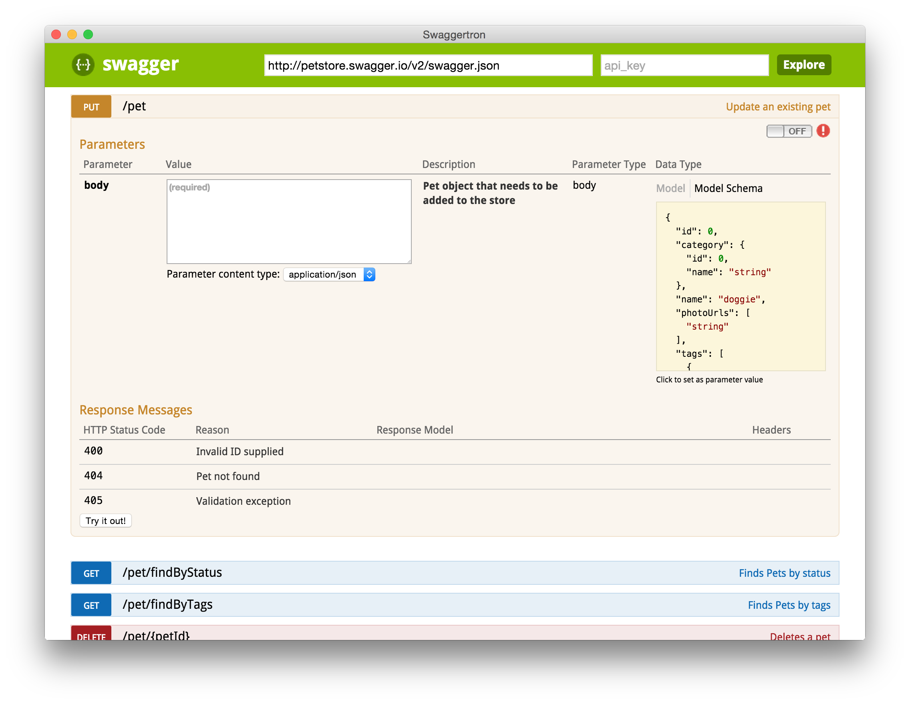

# Swaggertron

[Swagger UI](http://swagger.io/swagger-ui/) packaged as [electron](http://electron.atom.io/) app.



## Installation

You can download pre-built [binaries for OS X](https://github.com/fgnass/swaggertron/releases) or
package it yourself by cloning this repository:

```
git clone https://github.com/fgnass/swaggertron.git
cd swaggertron
npm install
npm run pack-osx
```
